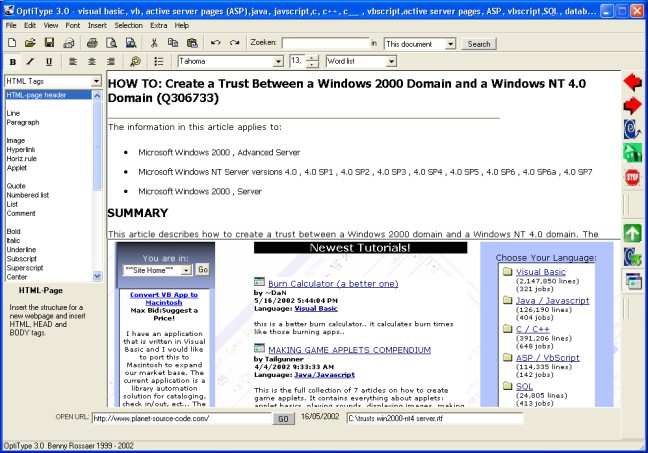



## OptiType 3\.0 \- Advanced word processor, HTML editor and webbrowser \(all in one\)

### Description

OptiType is a word processor, HTML editor, webbrowser, and editor for DOS batch files, all in one program. It has support for RTF and TXT files, HTML files (with an integrated preview window), and batch files. You get all the functionality of a word processor (font tools, print previews, find and replace routines, printing, inserting images, word count, e-mail, etc), plus wizards for creating letters and web pages. It has a seperate toolbar on the left that allows the user to quickly insert stuff like HTML tags and MS-DOS commands (for batch files). As an added bonus, this program can also be used as a fully functional webbrowser, even allowing you to instantly edit the source code of the website you're viewing.

This is a relatively big project (23 forms, 3 modules) and although this version is pretty much complete, I'm still improving things so any feedback would be more than welcome.
 
### More Info
 
The original program was written in dutch, however this version is 100% translated in English. The only downside is that, in the source code, some of the subroutine and variable names are still in dutch, so you may need to take your time to figure it out.

             |
---                |---
**Submitted On**   |2002-05-17 21:32:48
**By**             |[Benny Rossaer](https://github.com/Planet-Source-Code/PSCIndex/blob/master/ByAuthor/benny-rossaer.md)
**Level**          |Intermediate
**User Rating**    |5.0 (70 globes from 14 users)
**Compatibility**  |VB 5\.0, VB 6\.0
**Category**       |[Complete Applications](https://github.com/Planet-Source-Code/PSCIndex/blob/master/ByCategory/complete-applications__1-27.md)
**World**          |[Visual Basic](https://github.com/Planet-Source-Code/PSCIndex/blob/master/ByWorld/visual-basic.md)
**Archive File**   |[OptiType\_3843225172002\.zip](https://github.com/Planet-Source-Code/benny-rossaer-optitype-3-0-advanced-word-processor-html-editor-and-webbrowser-all-in-one__1-34858/archive/master.zip)

